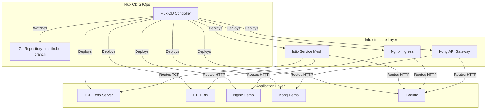

# Flux CD with Istio, Nginx, and Kong Demo

This repository demonstrates a complete GitOps setup using Flux CD to manage Istio Service Mesh (with TCP support), Nginx Ingress Controller, and Kong API Gateway on Minikube.

## 🏗️ Architecture



## 📁 Repository Structure

```
.
├── clusters/
│   └── minikube/
│       └── infrastructure.yaml          # Main Flux Kustomization
├── infrastructure/
│   ├── controllers/
│   │   ├── istio-release.yaml          # Istio Helm releases
│   │   ├── nginx-release.yaml          # Nginx Ingress Helm release
│   │   ├── kong-release.yaml           # Kong Helm release
│   │   └── kustomization.yaml
│   └── configs/
│       ├── istio-gateway.yaml          # Istio Gateway for HTTP/TCP
│       └── kustomization.yaml
├── apps/
│   ├── base/
│   │   ├── tcp-echo-app.yaml           # TCP echo server
│   │   ├── httpbin-app.yaml            # HTTP testing app
│   │   ├── nginx-demo-app.yaml         # Nginx Ingress demo
│   │   ├── kong-demo-app.yaml          # Kong demo with plugins
│   │   ├── istio-virtualservices.yaml  # Istio routing rules
│   │   └── kustomization.yaml
│   └── controllers/
│       ├── podinfo-release.yaml        # Podinfo Helm release
│       └── kustomization.yaml
└── docs/
    └── test-commands.md                # Testing instructions
```

## 🚀 Prerequisites

- Minikube installed and running
- kubectl configured
- Flux CLI installed
- Git repository initialized
- Helm installed

## 📦 Installation

### 1. Start Minikube

```powershell
minikube start --cpus=4 --memory=8192 --driver=docker
```

### 2. Bootstrap Flux CD

First, ensure you're on the minikube branch:

```powershell
git checkout minikube
```

Bootstrap Flux CD to watch the minikube branch:

```powershell
# For GitHub
flux bootstrap github `
  --owner=<your-github-username> `
  --repository=<repo-name> `
  --branch=minikube `
  --path=clusters/minikube `
  --personal

# For generic Git repository
flux bootstrap git `
  --url=<your-git-repo-url> `
  --branch=minikube `
  --path=clusters/minikube `
  --username=<git-username> `
  --password=<git-password-or-token>
```

### 3. Verify Flux Installation

```powershell
# Check Flux components
flux check

# Watch Flux reconciliation
flux get kustomizations --watch
```

### 4. Monitor Deployments

```powershell
# Watch all Helm releases
flux get helmreleases -A --watch

# Check infrastructure pods
kubectl get pods -n istio-system
kubectl get pods -n ingress-nginx
kubectl get pods -n kong

# Check application pods
kubectl get pods -n demo
```

## 🧪 Testing

### Istio Service Mesh

#### HTTP Traffic through Istio

```powershell
# Get Minikube IP
$MINIKUBE_IP = minikube ip

# Test httpbin through Istio Gateway
curl -H "Host: httpbin.local" http://${MINIKUBE_IP}:30080/headers

# Test podinfo through Istio
curl -H "Host: podinfo-istio.local" http://${MINIKUBE_IP}:30080/
```

#### TCP Traffic through Istio

```powershell
# Get Minikube IP
$MINIKUBE_IP = minikube ip

# Test TCP echo server (port 9000 mapped to NodePort 30900)
echo "Hello Istio TCP" | nc $MINIKUBE_IP 30900

# You should see: hello-istio-tcp
```

### Nginx Ingress Controller

```powershell
# Get Minikube IP
$MINIKUBE_IP = minikube ip

# Test Nginx demo app
curl -H "Host: nginx-demo.local" http://${MINIKUBE_IP}:30080

# Test podinfo through Nginx
curl -H "Host: podinfo.local" http://${MINIKUBE_IP}:30080/
```

### Kong API Gateway

```powershell
# Get Minikube IP
$MINIKUBE_IP = minikube ip

# Test Kong demo app (with rate limiting and CORS)
curl -H "Host: kong-demo.local" http://${MINIKUBE_IP}:32080

# Test podinfo through Kong
curl -H "Host: podinfo-kong.local" http://${MINIKUBE_IP}:32080/

# Check Kong Admin API
curl http://${MINIKUBE_IP}:32001/services
```

## 🔍 Observability

### Check Istio Mesh Status

```powershell
# Get Istio proxy status
kubectl exec -n istio-system deploy/istiod -- pilot-discovery request GET /debug/syncz

# Check Istio configuration
istioctl proxy-status

# Analyze Istio configuration
istioctl analyze -n demo
```

### View Logs

```powershell
# Istio ingress gateway logs
kubectl logs -n istio-system -l app=istio-ingressgateway --tail=50 -f

# Nginx ingress logs
kubectl logs -n ingress-nginx -l app.kubernetes.io/component=controller --tail=50 -f

# Kong logs
kubectl logs -n kong -l app.kubernetes.io/name=kong --tail=50 -f
```

## 🛠️ Troubleshooting

### Flux Not Reconciling

```powershell
# Force reconciliation
flux reconcile kustomization infrastructure --with-source
flux reconcile kustomization apps --with-source

# Check for errors
flux logs --level=error
```

### Istio Sidecar Not Injected

```powershell
# Verify namespace has injection label
kubectl get namespace demo --show-labels

# Manually label namespace
kubectl label namespace demo istio-injection=enabled --overwrite

# Restart pods to inject sidecar
kubectl rollout restart deployment -n demo
```

### Ingress Not Working

```powershell
# Check ingress resources
kubectl get ingress -n demo

# Describe ingress for events
kubectl describe ingress nginx-demo -n demo
kubectl describe ingress kong-demo -n demo

# Check ingress controller logs
kubectl logs -n ingress-nginx -l app.kubernetes.io/component=controller
kubectl logs -n kong -l app.kubernetes.io/name=kong
```

### Port Conflicts

If you encounter port conflicts, check what's using the ports:

```powershell
# Check NodePort services
kubectl get svc -A | Select-String "NodePort"

# Modify NodePort values in the Helm releases if needed
```

## 📊 Service Ports Reference

| Service | Type | Internal Port | NodePort | Access |
|---------|------|---------------|----------|--------|
| Istio Gateway HTTP | NodePort | 80 | 30080 | `http://<minikube-ip>:30080` |
| Istio Gateway HTTPS | NodePort | 443 | 30443 | `https://<minikube-ip>:30443` |
| Istio Gateway TCP | NodePort | 31400 | 31400 | `nc <minikube-ip> 31400` |
| Istio TCP Echo | NodePort | 9000 | 30900 | `nc <minikube-ip> 30900` |
| Nginx Ingress HTTP | NodePort | 80 | 30080 | `http://<minikube-ip>:30080` |
| Nginx Ingress HTTPS | NodePort | 443 | 30443 | `https://<minikube-ip>:30443` |
| Kong Proxy HTTP | NodePort | 80 | 32080 | `http://<minikube-ip>:32080` |
| Kong Proxy HTTPS | NodePort | 443 | 32443 | `https://<minikube-ip>:32443` |
| Kong Admin API | NodePort | 8001 | 32001 | `http://<minikube-ip>:32001` |

## 🎯 Key Features

### Istio Configuration
- ✅ Full service mesh with Envoy proxies
- ✅ TCP traffic support on dedicated ports
- ✅ Protocol sniffing for automatic protocol detection
- ✅ Access logging enabled for debugging
- ✅ Gateway configured for HTTP, HTTPS, and TCP

### Nginx Ingress
- ✅ Standard Kubernetes Ingress resources
- ✅ Metrics enabled
- ✅ Host-based routing
- ✅ Path-based routing

### Kong API Gateway
- ✅ DB-less mode for simplicity
- ✅ Ingress Controller enabled
- ✅ Rate limiting plugin
- ✅ CORS plugin
- ✅ Admin API accessible

### Test Applications
- ✅ TCP Echo Server for TCP testing
- ✅ HTTPBin for HTTP testing
- ✅ Nginx demo with custom HTML
- ✅ Kong demo with plugins
- ✅ Podinfo accessible via all three ingress methods

## 🔄 Making Changes

All changes should be made via Git commits to the `minikube` branch. Flux CD will automatically detect and apply changes.

```powershell
# Make changes to manifests
git add .
git commit -m "Update configuration"
git push origin minikube

# Watch Flux apply changes
flux get kustomizations --watch
```

## 📚 Additional Resources

- [Flux CD Documentation](https://fluxcd.io/docs/)
- [Istio Documentation](https://istio.io/latest/docs/)
- [Nginx Ingress Controller](https://kubernetes.github.io/ingress-nginx/)
- [Kong Gateway](https://docs.konghq.com/)
- [Minikube Documentation](https://minikube.sigs.k8s.io/docs/)

## 📝 License

This is a demo repository for learning purposes.
